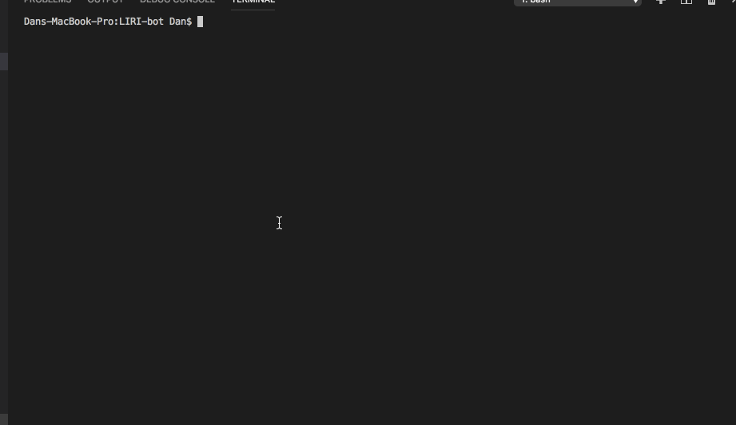

# LIRI_bot

LIRIbot is a program that helps provide the user with information about films, songs, and upcoming concerts. It draws from Spotify, Bands In Town, and the Open Movie Database.

When the program loads, the user is prompted to use the menu to choose which type of entertainment they are researching. A simple up/down keystroke menu and type input allows the user to search. After each search, the user can continue using LIRIbot without reloading the program from the terminal.

The two included gifs will demonstrate more about LIRIbot.
staggs_LIRI-bot_one.gif provides a short overview of the code.

staggs_LIRI-bot_two.gif demonstrates the functionality.

